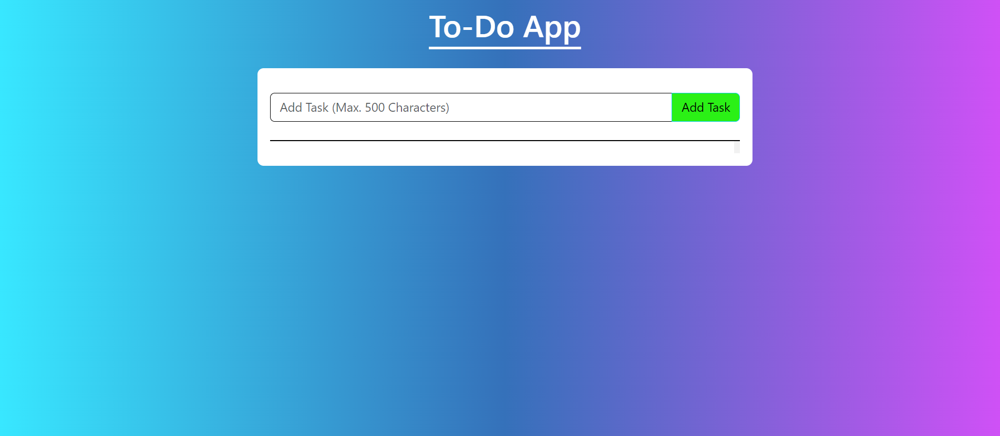
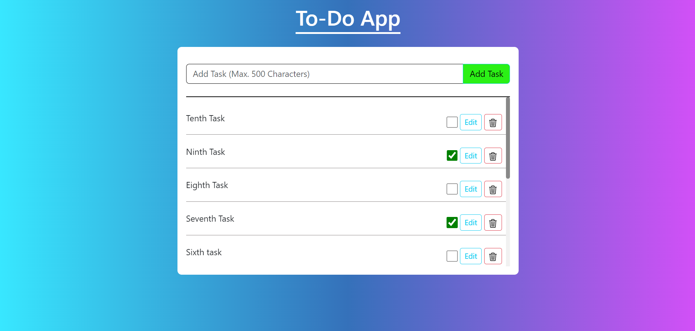
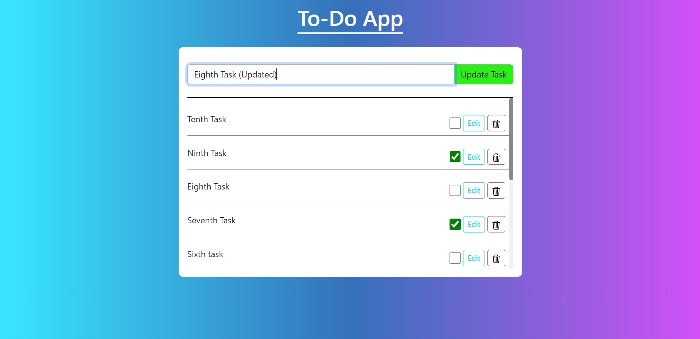
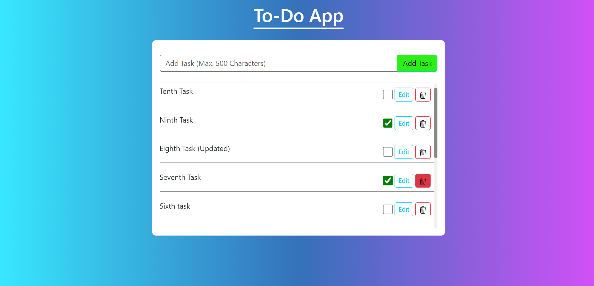
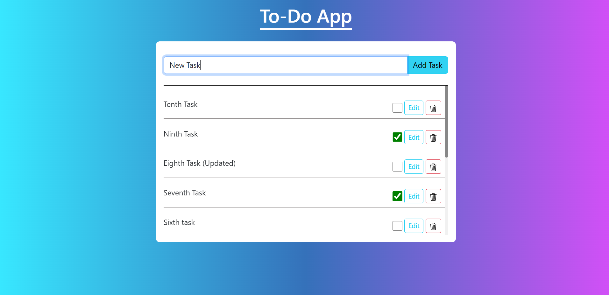

#  To-Do Web Application

This is To-Do Web application built using Django and Django REST Framework which works Asynchronously


## Features

- Creating Task
- Updating Task
- Deleting Task
- Task Completion Status


## Screenshots

 

 

 

 

 


## Run Locally

Clone the project

```bash
  git clone https://github.com/Shivakumar1V/To-Do-App-using-Django
```

Install dependencies

```bash
  pip install -r requirements.txt
```

Start the server

```bash
  python manage.py runserver
```

It will run the application on [http://127.0.0.1:8000/](http://127.0.0.1:8000/)

Now the application is ready to use  
Open your browser and go to **[http://127.0.0.1:8000/](http://127.0.0.1:8000/)** 